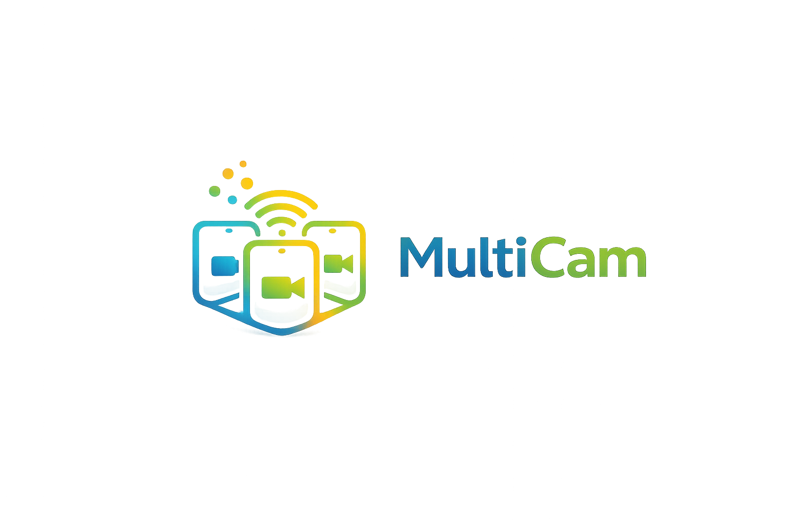

<p align="center">
  
</p>

<h1 align="center">MultiCam</h1>

A multi-camera video conferencing app that allows users to connect multiple devices on the same network (like old phones) to a single room, creating a seamless multi-cam experience. The application intelligently switches between microphones based on which device detects the loudest audio, eliminating feedback and enabling users to move freely while presenting.

<!-- [Live Demo](https://...) -->

## Features

- **Multi-Device Support**: Connect multiple cameras and microphones from different devices into a single conference room
- **Intelligent Audio Switching**: Automatically detects and switches between microphones based on audio levels, preventing feedback
- **Device Management**: View and manage all connected devices, their microphone status, and audio levels in real-time
- **Real-time Video Grid**: Display video feeds from all connected devices simultaneously
- **Room Management**: Create and manage conference rooms with secure token-based access
- **Comprehensive Diagnostics**: Built-in logging and debugging tools to troubleshoot connection issues

## Getting Started

### Prerequisites

- **Node.js** v16 or higher
- **npm**, **yarn**, **pnpm**, or **bun** package manager
- **LiveKit Server** (for local development or self-hosted deployment)

### Installation & Development

1. Clone the repository:
   ```bash
   git clone https://github.com/pkibbey/video-chat.git
   cd video-chat
   ```

2. Install dependencies:
   ```bash
   npm install
   ```

3. Set up LiveKit (see [LIVEKIT_SETUP.md](docs/LIVEKIT_SETUP.md) for detailed instructions):
   ```bash
   # Copy example environment variables
   cp .env.example .env.local
   ```

4. Start the development server:
   ```bash
   npm run dev
   ```

   For HTTPS (required for camera/microphone access in production):
   ```bash
   npm run dev:https
   ```

   Open [http://localhost:3000](http://localhost:3000) in your browser.

## Project Structure

### Key Components

- **EnhancedVideoChat.tsx**: Main video chat interface using LiveKit components, displays video grid and controls
- **DeviceManager.tsx**: Manages multiple connected devices, tracks audio levels, and switches the active microphone based on sound intensity
- **SimpleVideoGrid.tsx**: Renders video feeds from all participants in the room
- **RoomManager.tsx**: Handles room creation, joining, and participant management
- **ClientErrorLogger.tsx**: Captures and logs client-side errors for debugging

### API Routes

- **/api/initialize-rooms**: Creates and initializes conference rooms
- **/api/livekit-token**: Generates secure access tokens for LiveKit room connections
- **/api/room-management**: Provides room list and metadata management

### Configuration

- **livekit.ts**: LiveKit client configuration
- **logger.ts**: Centralized logging system for debugging
- **room-management.ts**: Room creation and management utilities

## Tech Stack

- **Next.js 15** - React framework with API routes and server-side rendering
- **React 19** - UI component library
- **TypeScript** - Static type checking
- **LiveKit** - Real-time video/audio streaming and room management
- **Tailwind CSS 4** - Utility-first CSS framework
- **shadcn/ui** - Accessible component library built on Radix UI
- **Biome** - Fast linter and formatter

## Additional Resources

- [Initial Setup Guide](docs/INITIAL_SETUP.md) - Project goals and original requirements
- [LiveKit Setup Guide](docs/LIVEKIT_SETUP.md) - Detailed LiveKit configuration and deployment options
- [Logging Guide](docs/LOGGING.md) - Debug logging and troubleshooting
